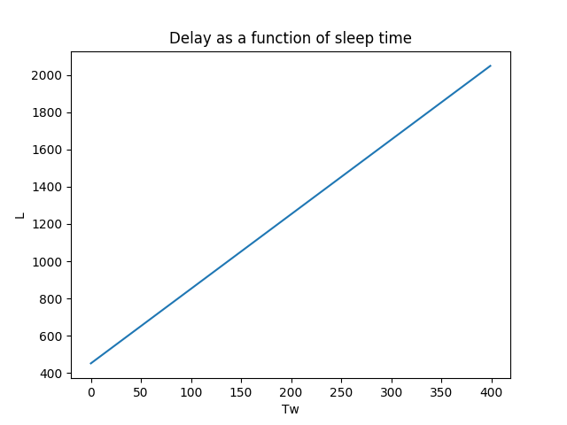
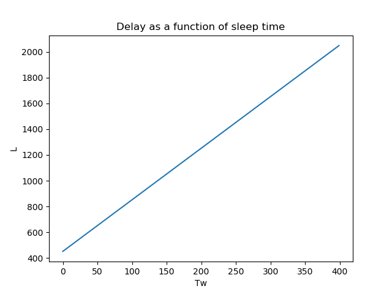
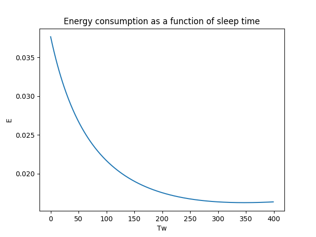
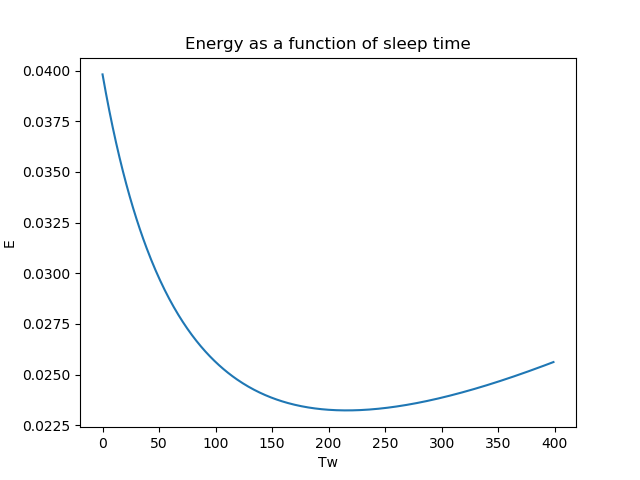
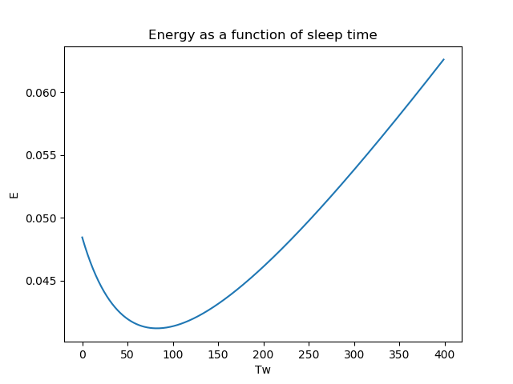
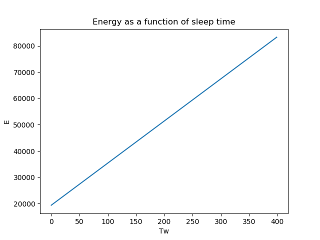
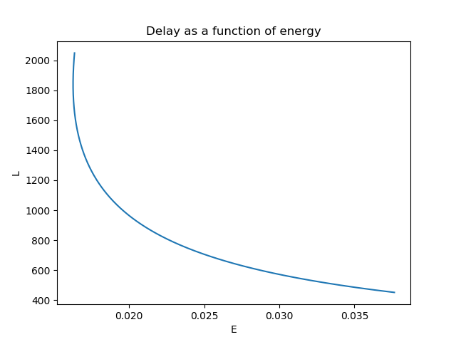
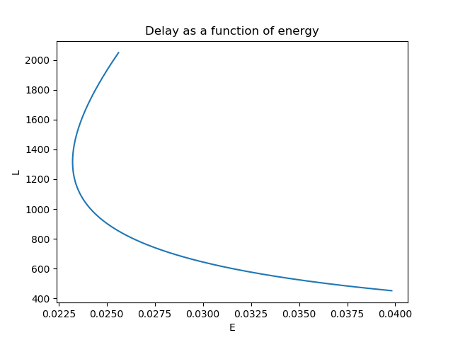
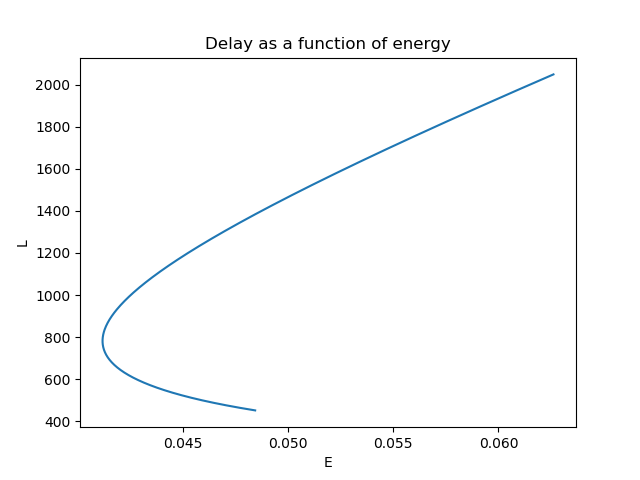
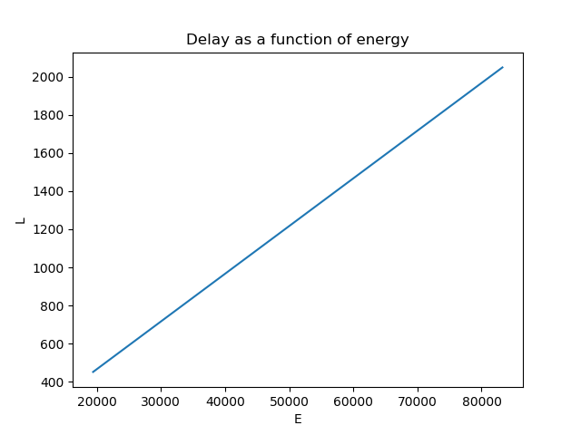

# Project 1. Duty-Cycle MAC Protocols - Energy Conservation

## Q1

#### Construct Topology
The first requirement is to construct an arbitrary topology of nodes. This is done by running
the script *IoT-GT-header.py* provided by prof. Ordinas.

The constructed topology has the following properties:
- Insert topology here.
- (Maybe even draw a graph visualizing the topology).

#### Calculate Values
In order to calculate the estimated energy conservation and the end-to-end delay of packet
transmission, the script *energy_latency_calculation.py* is constructed. This script inputs a
set of variables for different properties of the network, and calculates the results according to
the formulas provided by the project pdf document, *Table 2* respectively.
- Insert formulas here.

The following shows the values obtained from the previous script, the given values
by the pdf document and the self-determined values as well:
- Such values.

By inserting the aforementioned set of values into the constructed script, these results are
obtained:
- Wow.

#### Draw Curves
Consequently, a variety of curves can be drawn in order to see the relationsships between
the different elements.

**Energy as a function of sleep time**: For our specified time interval Tw € [100, 500], the curvature of the slope is approximately a negative exponential function. However, as the packet generation increases, we see that the energy starts to gradually increase.

**Delay as a function of sleep time**: The curve is increasing in a linear scale. The slope remains the same for each test, as a result of not being affected by the sampling rate.

**Delay as a function of energy**: The graph of with slowest packet generation shows that there is a significant relationship between energy and delay; the energy consumption is high when the delay is low and vica versa. Nonetheless, when increasing the packet sampling generation frequency, it isn't necessarily the case that the highest delay is equivalent to the lowest energy consumption.

The graphs of the energy vs. delay yields that there is a specific point when the delay starts increasing, as well as the energy consumption is increasing. This is a result of the waiting time is getting very large. Consequently, strobes will repeatedly be sent, but none of them will be acknowledged. Therefore, both energy and the delay will increase.

When the sampling rate is very high, we find ourselves in a case where our model is simply not suitable anymore. That would correspond to a scenario where the sleeping time is higher than the sampling interval. This results in graphs that makes no sense.

## Q2
- Solve optimization problem

## Q3
- Find trade-off - solve optimization problem

## Q4
- Use Kalai-Smorodinsky Bargaining Solution (KSBS) to find equal proportion of gain between
players.
