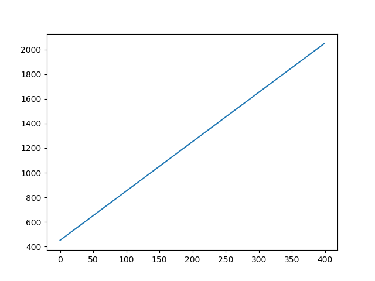
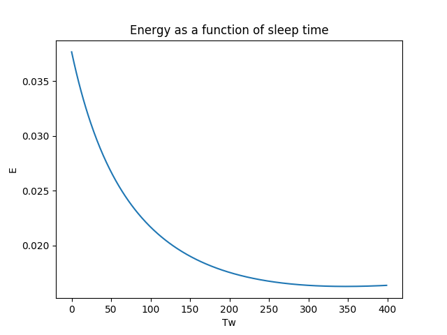
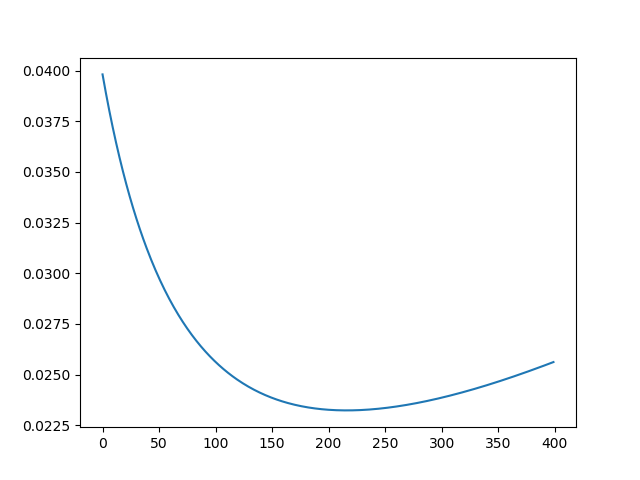
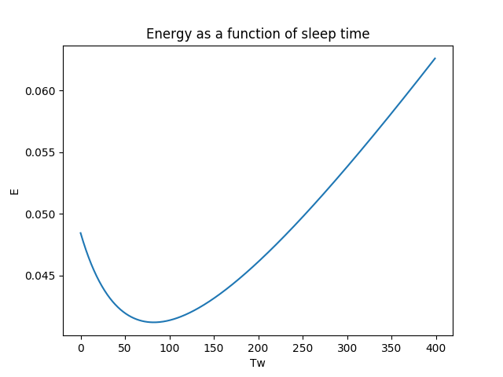
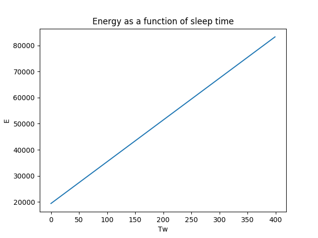
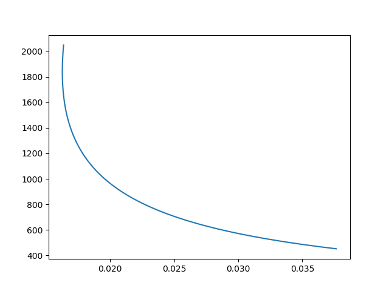
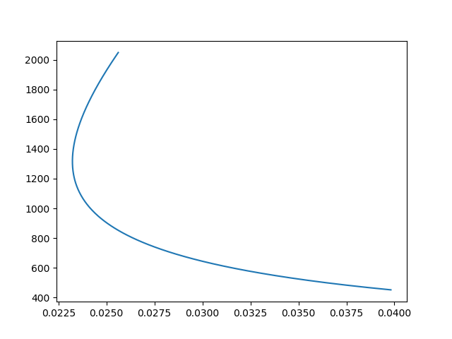
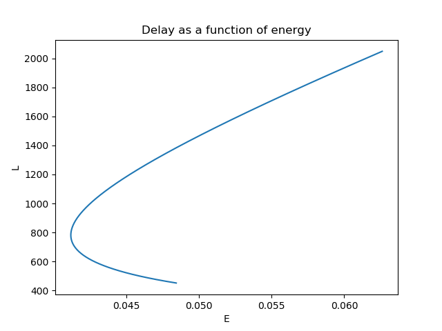
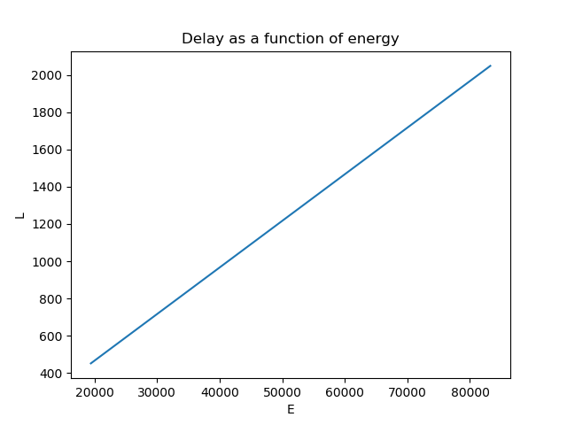

# Project 1. Duty-Cycle MAC Protocols - Energy Conservation

## Q1

#### Construct Topology
The first requirement is to construct an arbitrary topology of nodes. This is done by running
the script *IoT-GT-header.py* provided by prof. Ordinas.

The constructed topology has the following properties:
- Insert topology here.
- (Maybe even draw a graph visualizing the topology).

#### Calculate Values
In order to calculate the estimated energy conservation and the end-to-end delay of packet
transmission, the script *energy_latency_calculation.py* is constructed. This script inputs a
set of variables for different properties of the network, and calculates the results according to
the formulas provided by the project pdf document, *Table 2* respectively.
- Insert formulas here.

The following shows the values obtained from the previous script, the given values
by the pdf document and the self-determined values as well:
- Such values.

By inserting the aforementioned set of values into the constructed script, these results are
obtained:
- Wow.

#### Draw Curves
Consequently, a variety of curves can be drawn in order to see the relationsships between
the different elements.

## Q2
- Solve optimization problem

## Q3
- Find trade-off - solve optimization problem

## Q4
- Use Kalai-Smorodinsky Bargaining Solution (KSBS) to find equal proportion of gain between
players.
