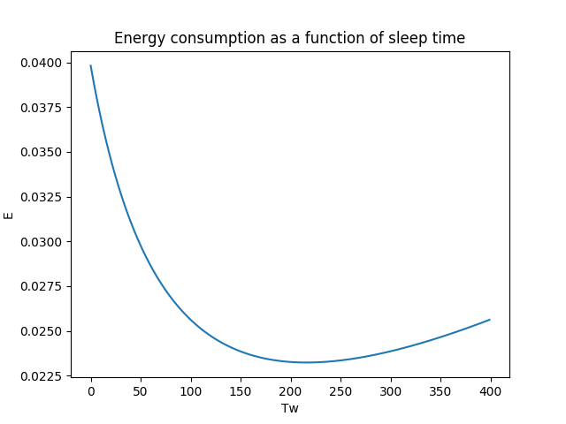
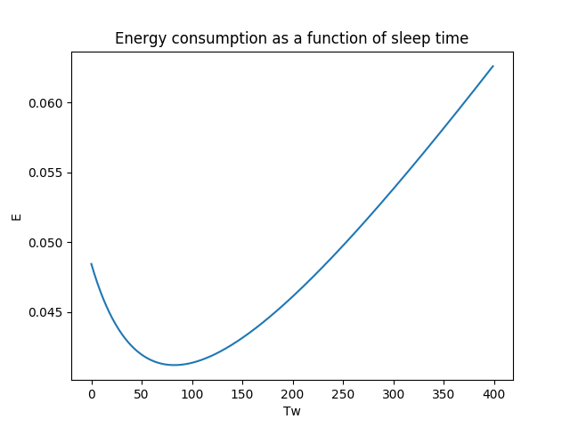
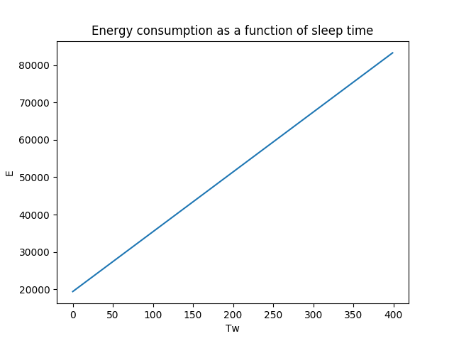
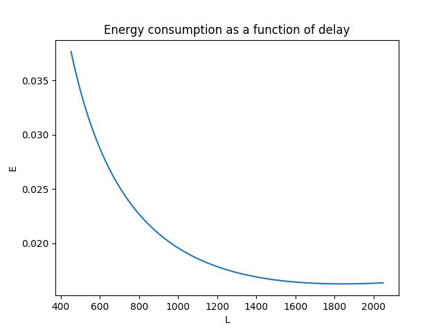
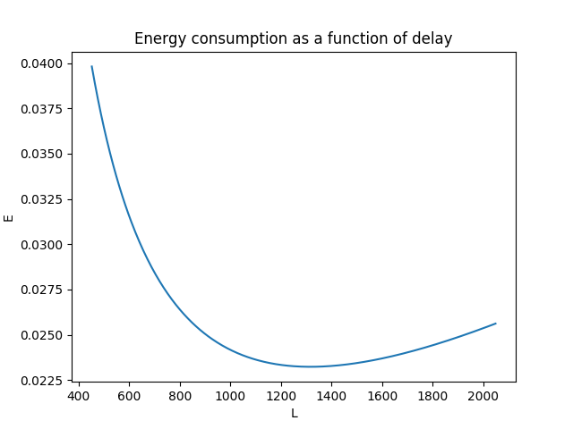
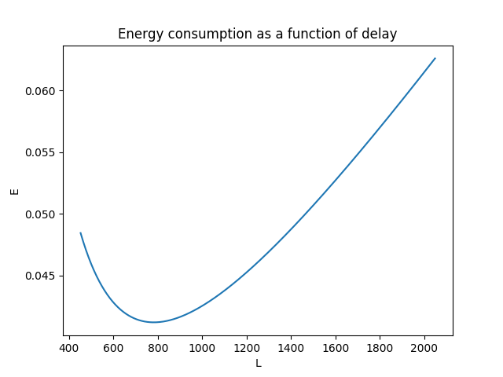
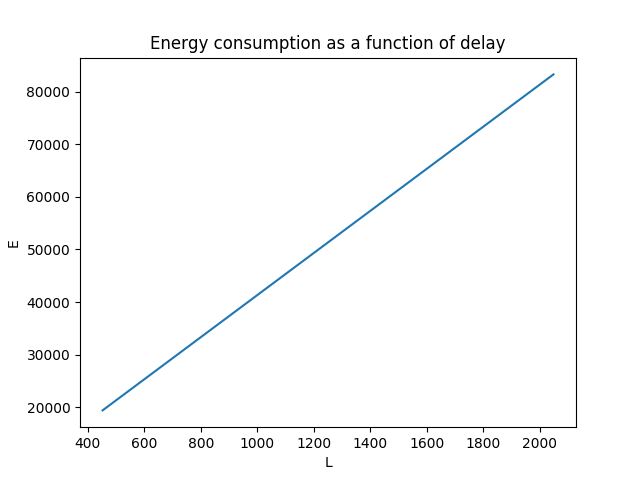
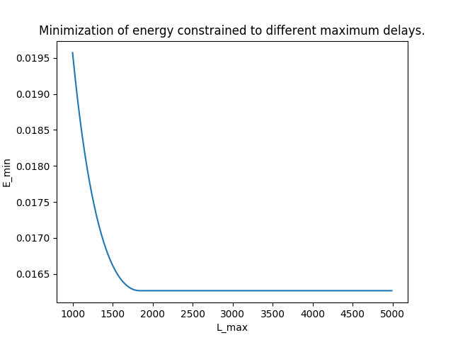
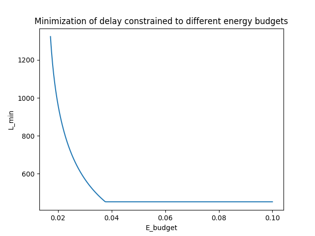

# Project 1. Duty-Cycle MAC Protocols - Energy Conservation

## Q1

#### Construct Topology
The first requirement is to construct an arbitrary topology of nodes. This is done by running
the script *IoT-GT-header.py* provided by prof. Ordinas.

The constructed topology has the following properties:
- number of nodes: 320
- number of rings: 8
- average number of neighbours per node: 5
- Number of neighbors per ring is Nd = (2d-1)*C
- Ring d = 1  has Nd =  5  nodes
- Ring d = 2  has Nd =  15  nodes
- Ring d = 3  has Nd =  25  nodes
- Ring d = 4  has Nd =  35  nodes
- Ring d = 5  has Nd =  45  nodes
- Ring d = 6  has Nd =  55  nodes
- Ring d = 7  has Nd =  65  nodes
- Ring d = 8  has Nd =  75  nodes

#### Calculate Values
In order to calculate the estimated energy conservation and the end-to-end delay of packet
transmission, the script *calculations.py* is constructed. This script inputs a
set of variables for different properties of the network, and calculates the results according to
the formulas provided by the project pdf document, *Table 2* respectively.

#### Draw Curves
By inserting the aforementioned set of values into the constructed script, results for energy consumption and overall network latency is obtained Consequently, a variety of curves can be drawn in order to see the relationsships between the different elements.

**Energy consumption as a function of sleep time**

For our specified time interval Tw in [100, 500], the curvature of the slope is approximately a negative exponential function when packets are generated at a relatively slow pace. However, as the packet generation increases, we see that the energy also starts to gradually increase when the sleeping time increases.

**Delay as a function of sleep time**

The curve is increasing in a linear scale. The slope remains the same for each test, as a result of not being affected by the sampling rate.

**Energy consumption as a function of delay**

The graph with the slowest packet generation shows that there is a significant relationship between energy and delay; the energy consumption is high when the delay is low and vica versa. However, when increasing the packet sampling generation frequency, it isn't necessarily the case that the highest delay is equivalent to the lowest energy consumption.

The graphs of the energy vs. delay yields that there is a specific point when the delay starts increasing, as well as the energy consumption is increasing. This is a result of the waiting time is getting very large. Consequently, strobes will repeatedly be sent, whereas none of them will be acknowledged. Therefore, both energy and the delay will increase.

When the sampling rate is very high, we find ourselves in a case where our model is simply not suitable anymore. That would correspond to a scenario where the sleeping time is higher than the sampling interval. This results in graphs that makes no sense.

## Q2
For the optimization problems that are presented in the project, we choose to use Python with library gpkit with coherent dependencies.

**Minimize energy consumption subject to some maximum delay**

The graph yields that for an *Lmax* value lower than roughly 1800 ms, the minimal energy consumption increases exponentially. At the same time, we also see that there is no benefit in increasing the maximum delay, in terms of reduced energy consumption.

**Minimize delay subject to some energy budget**

For the minimization of delay instead of energy, the same pattern occurs. There is a specific point for e_budget of around 0.038 where a lower budget will significantly increase the delay, and likewise, a higher energy budget will not improve it.

It interesting to notice that for both scenarios, there is a specific point where increasing one variable do not affect the other variable in any noticable way. This means that we certaintly can make usage of optimization techniques in order to find the best possible trade-off between the mentioned variables and therefore the system as a whole. 

## Q3
Paper "Game thoery framework for MAC parameter optimization in energy-delay constrained sensor networks" describes the Nash Bargaining Solution (NBS) as a bargaining game and solves it by creating an optimization problem as a joint collaboration. The solution is obtained when setting the initial guesses to the following:
- E: 0
- L: 2000
- Tw: 100

After ordering the optimization problem as showed in the project paper, the following results were obtained:

- E: 0.02073552413655712
- L: 910.5275002331807
- Tw: 214.61987505829512
- Res: -2.9609706782

In other words, the energy consumption is 0.021J, the latency is 910.5ms, which is obtained when the wake-up period interval is set to 214.6ms.

## Q4
- Use Kalai-Smorodinsky Bargaining Solution (KSBS) to find equal proportion of gain between
players.

KSBS is yet another method for finding the trade-off. In this case, it considers energy and latency as two different players and negotiates on behalf of each such that an optimized value is found. The following initial guess is used

- r: 100000000
- Tw: 250

which yields these results:

- r: 199829566.97346354
- Tw: 216.27181161940098

In other words, the KSBS point is when the wake-up interval is 216.3ms.

