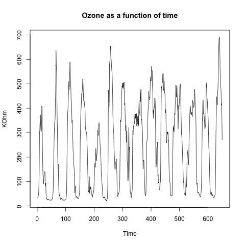
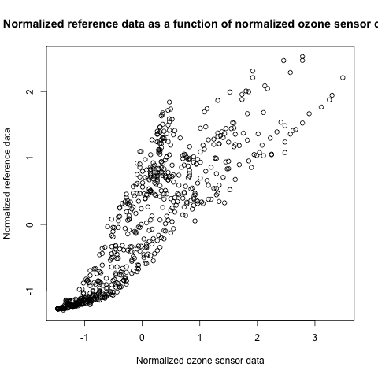
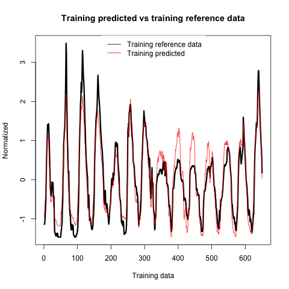
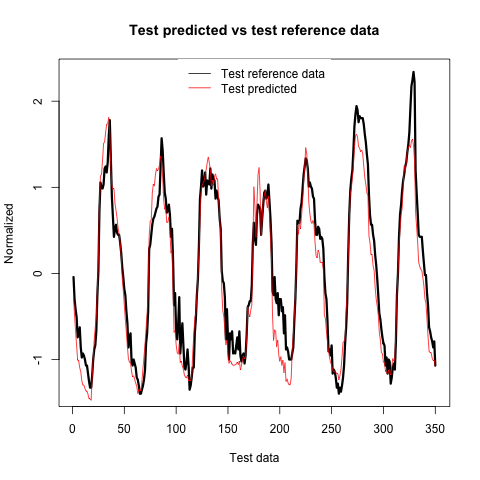
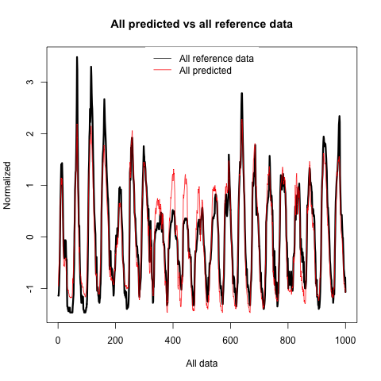
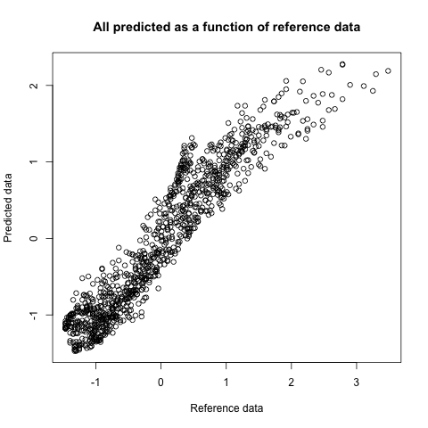
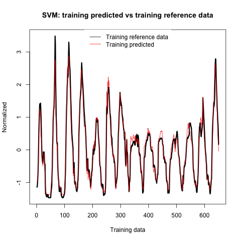
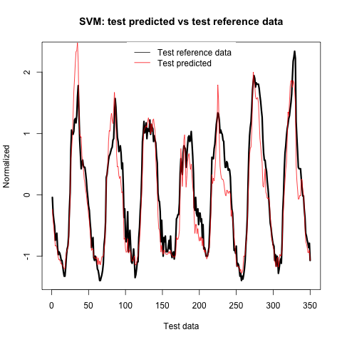
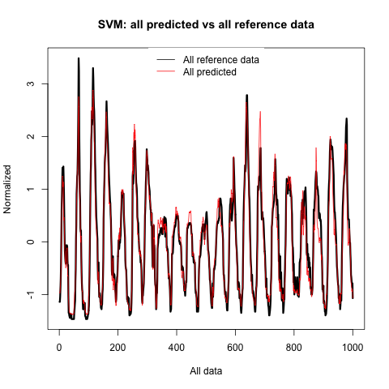

# Project 2

Abstract/Intro

## 2.2: Project Realization (Practical Part I)

### Q1
The following plots shows the ozone as a function of time and the reference data as a function of time respectively.

We see that there is a significant resemblance between the two plots, however with some considerable differences.

### Q2
The attached file *calculations.Rmd* calculates the mean and standard deviation for each of the properties, and displays it in the output console.

### Q3
The following scatter-plot shows the linear dependence between the reference data and the sensor data.

As we see, there is clearly a dependence amongst the two, but the error of the sensor contributes to spread the data.

### Q4
By performing multiple linear regression using the built-in method of RStudio, the following betas are obtained:

- **\beta0** ~ 0

### Q5

### Q6

## 2.3: Project Realization (Practical Part II)

## 2.4: Project Realization (Practical Part II)

