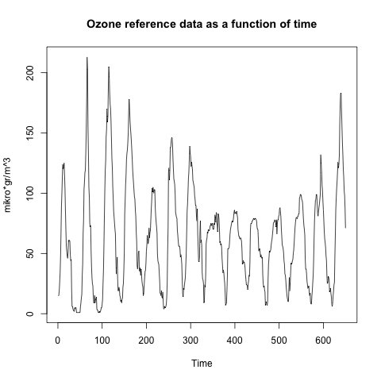

# Project 2

Abstract/Intro

## 2.2: Project Realization (Practical Part I)

### Q1
The following plots shows the ozone as a function of time and the reference data as a function of time respectively.

We see that there is a significant resemblance between the two plots, however with some considerable differences.

### Q2
The attached file *calculations.Rmd* calculates the mean and standard deviation for each of the properties, and displays it in the output console.

### Q3
The following scatter-plot shows the linear dependence between the reference data and the sensor data.

As we see, there is clearly a dependence amongst the two, but the error of the sensor contributes to spread the data.

### Q4
By performing multiple linear regression using the built-in method of RStudio, the following betas are obtained:

- **β0** ~ 0.00
- **β1** ~ 0.43
- **β2** ~ 0.67
- **β3** ~ 0.05

The obtained statistical properties yield:
- **R2**: 0.8813
- **RMSE**: 14.75

These values reveals that the linear regression is a good prediction of the actual data.

### Q5
When prediciting the test data, the obtained statistical properties yield:
- **R2**: 0.9143
- **RMSE**: 11.777

This is in fact an even better prediction for the test data compared to the training data.

### Q6
The following plots shows the predicted data in the same plot as the actual reference data. The black line represents the actual data, while the red line represents the predicted data.

**Training predicted vs. training reference data**

**Test predicted vs. test reference data**

**All predicted vs. all reference data**

**Scatter-plot of predicted data vs reference data**

## 2.3: Project Realization (Practical Part II)

## 2.4: Project Realization (Practical Part II)

